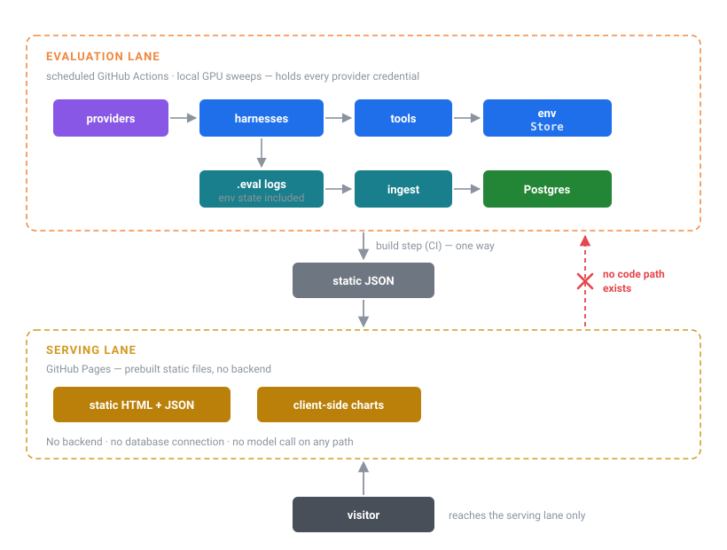
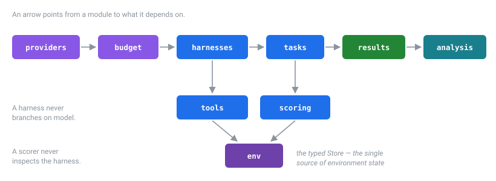

# Architecture

Two things shape this system: the experiment must be **reproducible from
artifacts alone**, and it must cost **$0** without relying on anyone remembering
to be careful.

---

## 1. The two-lane architecture

The cost property is structural, not a configuration setting. That distinction is
the point.

<p align="center">
  
</p>

**A visitor cannot cause a model call.** Not because a rate limiter says no —
because there is no code path from the public internet to a provider. The serving
lane is prebuilt static files; the expensive path exists only in scheduled jobs
that the public cannot trigger.

Most projects control cost by bolting rate limits onto the request path. This one
makes the expensive path **structurally unreachable**. A rate limit is a setting
someone can misconfigure; an absent code path is not.

Consequences worth naming: the site cannot sleep, cannot be scraped into a bill,
never rots, and survives the project being abandoned.
[SPEC-020 AC-2](../specs/SPEC-020-leaderboard.md) enforces it with a test that
scans built output for provider endpoints and keys.

---

## 2. Building on Inspect AI

Inspect (UK AI Security Institute) supplies `Task` / `Solver` / `Scorer`, which
map exactly onto **task / harness / scoring**. Three of its features do real work
here, and three things it offers are deliberately declined.

### Used

**The typed `Store`** is the environment. `StoreModel` is a Pydantic model with
sample-scoped state, so the virtual filesystem, SQL database, and calendar live
there. Inspect serializes it into the `.eval` log automatically, which gives three
properties for free:

- final-state scoring is a **pure function of data already in the log**,
- the environment a trajectory left behind is visible in `inspect view`,
- a published log can be **re-scored later without rerunning any model**.

**Native providers.** `groq/`, `google/`, `mistral/`, `ollama/`, `openrouter/`
are built in; Cerebras rides the built-in `openai-api/cerebras/<model>` path. No
translation layer, and one source of truth for token accounting.

**`samples_df()`** already yields per-sample token usage, timing, scores and
errors. Ingest is a mapping from that dataframe to normalized rows — not a
bespoke telemetry layer with a second source of truth.

### Declined

**No `SandboxEnvironment`.** It is for untrusted *code execution*, which this
suite never does. Docker-per-task would add startup cost per sample and give up
the log-serialization properties above. See [adr/0002](adr/0002-store-not-sandbox.md).

**No LiteLLM.** Every provider is reachable natively. See
[adr/0001](adr/0001-drop-litellm.md).

**No `model_graded_qa()`.** Inspect ships it and it would have made the suite far
easier to author. Declining it is the project's central methodological
commitment — see [METHODOLOGY.md §1](METHODOLOGY.md) and
[adr/0004](adr/0004-no-llm-judge.md).

---

## 3. Module map

```
src/harnesslab/
  providers/   Model catalog, quota descriptors, pricing loaders.
               Describes limits; does not enforce them.

  env/         StoreModel environments + the deterministic generator.
               Pure: no I/O, no clock, no global RNG.

  tools/       The agent's entire interface to the world. Identical
               across every harness and model -- that identity is what
               keeps the harness comparison honest.

  harnesses/   The independent variable. Five solvers behind one protocol,
               each parameterised by turn cap and context policy.

  scoring/     Deterministic scorers. Pure functions of (state, target);
               indifferent to which scaffold produced the state.

  tasks/       Task definitions + committed reference solutions.
               Definitions contain no content, only generator calls.

  budget/      Estimator, ledger, admission control. The component that
               makes an unattended sweep on free quota trustworthy.

  results/     Schema, ingest, repository. Postgres primary,
               SQLite behind the same interface for fork-PR CI.

  analysis/    bootstrap -> stats -> ablation -> pareto -> failures.
```

### Dependency direction

<p align="center">
  
</p>

Nothing in `analysis/` is imported by anything that runs during a sweep, and
nothing in `harnesses/` knows which model it is running. Two invariants follow:

- **A harness never branches on model identity**
  ([SPEC-007 AC-7](../specs/SPEC-007-harness-singleshot-react.md)). Otherwise the
  harness axis and the model axis stop being independent.
- **A scorer never inspects the harness**
  ([SPEC-004 AC-7](../specs/SPEC-004-scorers.md)). The measuring instrument must
  be indifferent to the thing being varied.

---

## 4. Reproducibility

Every result row answers *"what exactly produced this number?"* — `git_sha`,
`seed`, `seed_regime`, `model_digest`, `quantization`, `context_policy`,
`block_id`.

Two are less obvious and both were added because their absence would have
silently corrupted the analysis:

**`model_digest`, not a tag.** `ollama/qwen2.5:7b` six months from now will not be
the weights that produced these numbers. See
[adr/0011](adr/0011-pin-model-digests.md).

**`context_policy` on every row.** Capped and uncapped runs of the same cell are
different measurements, and the compaction ablation depends on telling them
apart. Pooling them would reintroduce the exact confound the control removes.

Artifacts are written **before** the database: `.eval` logs upload as CI artifacts
first, then ingest. The DB write is the step most likely to fail unattended, and a
sweep whose results exist only in a database that rejected the write has burned
irreplaceable quota for nothing.

---

## 5. The offline guarantee

`make check` runs lint, types, and tests with **zero network calls**. Tests that
need a provider carry the `network` marker; those needing the GPU carry `gpu`;
neither runs by default.

This is a budget property, not just hygiene. The project's quota is the
experiment's scarcest resource, and a test suite that quietly spent tokens on
every run would consume the thing it exists to protect. It is also what lets
`ci.yml` pass on fork PRs, which cannot read secrets.
