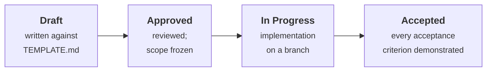

# The spec process

HarnessLab is built spec by spec. **One spec is implemented, reviewed, and merged
at a time.** Nothing is written outside an approved spec.

This is not ceremony. The project's output is a *claim* about measured effects,
and the credibility of that claim rests on decisions made before the data
existed. A spec is where a decision gets written down while it is still cheap to
change, and where the acceptance criteria that will prove it get fixed before
anyone is invested in a particular answer.

## Lifecycle

A spec's status lives in its own frontmatter. `ROADMAP.md` is the single source
of **execution order** and is the file to read first.

## Two kinds of spec in this repo

**Full specs** are written completely before implementation: motivation, interface
contract, design notes, numbered acceptance criteria, test plan. Specs 000–006
are full, because they define contracts everything else depends on.

**Stub specs** carry scope and acceptance criteria only. They exist so the
dependency graph is complete and the roadmap is honest, but their interface
contracts are deliberately left unwritten. Specs 007 onward are stubs.

This is a considered choice, not laziness. Writing a detailed interface contract
for a harness before having felt how Inspect's `Agent`/`AgentState` actually
behaves guarantees a rewrite, and **a stale spec is worse than an absent one** —
it invites implementation against a fiction. A stub is sharpened into a full
spec at the moment its dependencies land, when the contract can be written from
knowledge rather than from guesswork.

## Spec numbering

Spec IDs are **stable and never reused**. They are allocation order, not
execution order — 028–031 were added mid-planning and execute in the middle of
the project. When you want to know what to do next, read `ROADMAP.md`; when you
want to reference a decision permanently, use the spec ID.

## Definition of done

A spec is `Accepted` when *all* of the following hold:

1. `make check` is green — ruff, mypy `--strict`, and the offline test suite.
2. Every numbered acceptance criterion has been individually demonstrated, and
   the demonstration is a test, not a screenshot.
3. Documentation affected by the spec has been updated in the same change.
4. No test in the default path makes a network call to a paid endpoint. The
   `network` and `gpu` markers exist precisely so that `make check` never
   depends on a provider being up or a quota being unspent.

## Writing a good acceptance criterion

Criteria are numbered so they can be cited in review. Each one must be
falsifiable by a test. Compare:

> ✗ The generator should be deterministic.
>
> ✓ **AC-3.** `generate_env(seed=42, spec=FS_SMALL)` called twice in separate
> processes produces byte-identical serialized state, verified by SHA-256 of the
> canonical JSON dump.

The second can fail. The first cannot, which makes it worthless as a gate.

## Relationship to the docs

Specs describe **what to build**. `../docs/` describes **what was decided and
why** — the methodology, the experimental design, the cost model. When a spec
makes a methodological commitment, that commitment belongs in `../docs/`, and
the spec links to it rather than restating it. `../docs/adr/` holds the decision
records, one per design decision, each naming the alternatives that were
rejected.
