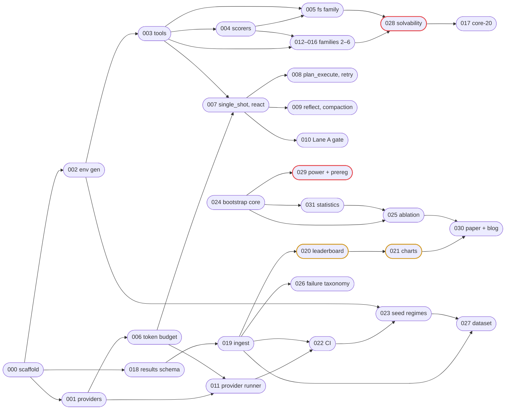

# Roadmap

The single source of **execution order**. Spec IDs are allocation order and do
not run in numeric order — read this table, not the filenames.

**Timeline: 37 working days ≈ 7.5 calendar weeks.**

## Current status

<!-- BEGIN GENERATED: progress -->

`····························`  **0 / 32 specs accepted**

Draft 32

**Next:** SPEC-000 — Repo scaffold, uv, tooling, CI skeleton (day 1, Draft)

9 documents · 11 ADRs · 0 implementation files

<!-- END GENERATED: progress -->

Per-spec status

<!-- BEGIN GENERATED: spec-status -->

| Day | Spec | Title | Status |
|---|---|---|---|
| 1 | 000 | Repo scaffold, uv, tooling, CI skeleton | 📝 Draft |
| 1 | 001 | Provider registry, quota limits, and capability probe | 📝 Draft |
| 2 | 002 | Deterministic procedural environment generator | 📝 Draft |
| 3 | 003 | Tool layer over the Store-backed environment | 📝 Draft |
| 4 | 004 | Deterministic scorers — final state, exact match, refusal | 📝 Draft |
| 5 | 005 | Task family 1 — filesystem, 10 tasks across 3 difficulty tiers | 📝 Draft |
| 6 | 006 | Token estimator, quota ledger, and admission control | 📝 Draft |
| 7 | 007 | Harnesses — single_shot and react | 📝 Draft |
| 8 | 010 | Lane A model gate — VRAM fit, throughput, tool-call floor | 📝 Draft |
| 9 | 008 | Harnesses — plan_execute and react_retry | 📝 Draft |
| 10 | 009 | Harness react_reflect and the context-compaction policies | 📝 Draft |
| 11 | 011 | Multi-provider runner — backoff, quota tracking, graceful degradation | 📝 Draft |
| 12 | 012 | Task family 2 — SQL over SQLite | 📝 Draft |
| 13 | 013 | Task family 3 — multi-hop tool composition | 📝 Draft |
| 14 | 014 | Task family 4 — constraint satisfaction over a mock calendar | 📝 Draft |
| 15 | 015 | Task family 5 — error recovery | 📝 Draft |
| 16 | 016 | Task family 6 — refusal tier | 📝 Draft |
| 18 | 028 | Solvability validation and reference solutions | 📝 Draft |
| 19 | 017 | Core-20 suite selection and lane assignment | 📝 Draft |
| 19 | 024 | Bootstrap core — resampler and range-contrast estimator | 📝 Draft |
| 20 | 029 | Power analysis and pre-registration | 📝 Draft |
| 21 | 018 | Results schema, Postgres store, migrations | 📝 Draft |
| 22 | 019 | Ingest — Inspect samples_df() to normalized rows | 📝 Draft |
| 23 | 020 | Static leaderboard generator and Pages deploy | 📝 Draft |
| 24 | 021 | Charts and the vector-PDF export pipeline | 📝 Draft |
| 25 | 022 | CI workflows — smoke, sharded sweep, secrets, artifacts | 📝 Draft |
| 25 | 023 | Dual seed regimes — fixed primary and rotating public | 📝 Draft |
| 27 | 025 | Ablation — range contrast, GLMM, and the suppression estimate | 📝 Draft |
| 29 | 031 | Full statistics module — CIs, GLMM, variance components | 📝 Draft |
| 34 | 026 | Failure taxonomy — manual coding protocol | 📝 Draft |
| 35 | 027 | HuggingFace dataset release and card | 📝 Draft |
| 36 | 030 | Paper and blog publication pipeline | 📝 Draft |

<!-- END GENERATED: spec-status -->

Both blocks are regenerated from spec frontmatter by the pre-commit hook.

## Ordering invariant

> A spec's dependencies must **never be scheduled on a later day** than the spec
> itself. Same-day dependencies are permitted; within a day, the row order below
> is the build order.

This is checked mechanically, not by eye. An earlier revision of the plan had
the power analysis (029) scheduled on Day 18 while the bootstrap it simulates
over (024) landed on Day 25 — a dependency that resolved on paper but was
unrunnable in practice. This invariant is what catches that class of error, and
it is verification item 1 in the plan.

The three same-day pairs are deliberate: `000 → 001` (scaffold then registry),
`022 → 023` (CI then seed regimes), and `017 ‖ 024` — which are *independent*,
since the bootstrap core is generic statistics developed against synthetic data
and does not need the suite selection.

## Execution order

| Day | Spec | Title | Depends on | Gate |
|---|---|---|---|---|
| 1 | 000 | Repo scaffold, uv, tooling, CI skeleton | — | `inspect eval` produces a log |
| 1 | 001 | Provider registry + limits + capability probe | 000 | Six providers verified live |
| 2 | 002 | Deterministic environment generator | 000 | Same seed → byte-identical env |
| 3 | 003 | Tool layer over the Store-backed env | 002 | No side effect escapes the Store |
| 4 | 004 | Deterministic scorers | 002, 003 | Known-good 1.0, broken 0.0 |
| 5 | 005 | Task family 1 — filesystem | 003, 004 | **First real accuracy number** |
| 6 | 006 | Token estimator + ledger + admission control | 001 | Forecast within ±25% of actual |
| 7 | 007 | Harnesses: `single_shot`, `react` | 003, 006 | Two harnesses, different scores |
| 8 | 010 | Lane A model gate: VRAM, throughput, tool-call floor | 007 | **Go/no-go on the local model axis** |
| 9 | 008 | Harnesses: `plan_execute`, `react_retry` | 007 | Four harnesses |
| 10 | 009 | `react_reflect` + context-compaction policies | 007 | Runs inside an 8K cap |
| 11 | 011 | Multi-provider runner: backoff, quota, degradation | 001, 006 | Same eval across 5+ models |
| 12 | 012 | Task family 2 — SQL over SQLite | 003, 004 | |
| 13 | 013 | Task family 3 — multi-hop tool composition | 003, 004 | |
| 14 | 014 | Task family 4 — constraint satisfaction (calendar) | 003, 004 | |
| 15 | 015 | Task family 5 — error recovery (fail-once tool) | 003, 004 | *arXiv endorsement request* |
| 16 | 016 | Task family 6 — refusal tier + refusal scorer | 004 | 53 tasks |
| **17** | — | **Buffer** — absorbs task-authoring overrun | — | — |
| 18 | 028 | Solvability validation + reference solutions | 012–016 | **No broken task reaches a sweep** |
| 19 | 017 | Core-20 selection + lane assignment | 028 | Balanced pooled grid defined |
| 19 | 024 | Bootstrap core — resampler + range-contrast estimator | — | Estimator reproduces a known contrast |
| 20 | 029 | Power analysis + pre-registration draft | 024 | **MDE known while grid is adjustable** |
| 21 | 018 | Results schema + Postgres + migrations | 000 | Rows traceable to commit SHA |
| 22 | 019 | Ingest: `samples_df()` → normalized rows | 018 | Results queryable |
| 22 | 029 | `PREREGISTRATION.md` committed and timestamped | 024 | **Prereg precedes all data** |
| 23 | 020 | Leaderboard generator + Pages deploy *(protected)* | 019 | **Public URL live** |
| 24 | 021 | Charts + vector-PDF export *(protected)* | 020 | Web + paper figures, one source |
| 25 | 022 | CI workflows: smoke, sharded sweep, secrets | 011, 019 | Nightly smoke unattended |
| 25 | 023 | Dual seed regimes: fixed primary + rotating public | 002, 022 | Two regimes, documented |
| **26** | — | **Buffer** | — | — |
| 27 | — | Launch Lane A (A1→A3→A2) **and** Lane B, concurrently | 022, 023 | Both sweeps underway |
| 27 | 025 | Ablation: range contrast, GLMM, suppression estimate | 024 | Runs on partial data |
| **28** | — | **Buffer** — sweeps running | — | — |
| 29 | 031 | Full statistics module — CIs, GLMM, variance components | 024 | CIs on all reported quantities |
| 30 | — | **Lane A checkpoint** — extrapolate, apply cut ladder | — | **Timing risk resolved** |
| 31 | — | Lane B complete; A1 complete | — | Pooled grid data in hand |
| 32 | 025 | **Pooled ablation — the headline finding** | 024, 031 | **Primary result** |
| 33 | — | A3 complete → compaction result + suppression estimate | 025 | Headline's floor quantified |
| 34 | 026 | Failure taxonomy — manual coding, dedicated day | 019 | 150 trajectories coded |
| 35 | 027 | HuggingFace dataset release + card | 019, 023 | Citable artifact |
| 36 | 030 | Paper draft, LaTeX 5–6pp; figures final | 021, 025 | Paper-shaped output |
| 37 | 030 | Blog post; publish; share | 021, 025 | Traction |
| post | — | TMLR submission | — | — |

## Dependency graph

An arrow points from a spec to the spec that depends on it.

Red outline = a gate that blocks everything downstream. Amber = protected
scope (see below). **024 depends on nothing** — it is generic statistics tested on
synthetic data, which is what lets 029 run the day after it.

## Protected scope

**020 and 021 are protected.** They are the artifact that carries the work to
readers, and they ship on Days 23–24 against smoke data — before any sweep
starts — precisely so that endgame pressure cannot reach them. They depend only
on the ingest layer, so nothing upstream can block them.

Under time pressure the release valve is **task count**: fall back from 53 tasks
to the core 20 plus whatever tail is finished. The pooled primary grid only ever
used the core 20, so cutting the tail costs per-family breakdown detail and
costs the headline finding nothing.

## Lane A cut ladder

Applied at the Day 30 checkpoint if Lane A projects past Day 33. In order:

1. A3 seeds 3 → 2 (~7.5 GPU-h)
2. A2 seeds 5 → 3 (~4.7 GPU-h)
3. A2 drops the 12B model (~6.7 GPU-h)

**A1 is never cut** — it is the pooled grid, and it runs first for that reason.
See `../docs/EXPERIMENT_DESIGN.md`.
